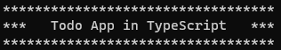

# Bootcamp 2021 Project 01: Todo Console and Persistent Data App in TypeScript

By doing this project we are able to learn following:-

- How to create a typescript project
- Data types in typescript
- Classes
- Functions
- Methods
- Conditional Statements
- Loops
- Third Party Package
  - inquirer
  - lowdb

This project is completed by following chapter one of "Essential TypeScript From Beginner to Pro" by "Adam Freeman"

## Project Output

As this is a console based project so output of the code at various steps are given in the image form for better understanding of the code. (titles of the images are based on commits)

**Initialize a basic TypeScript project**

**Create Basic Todo App**

